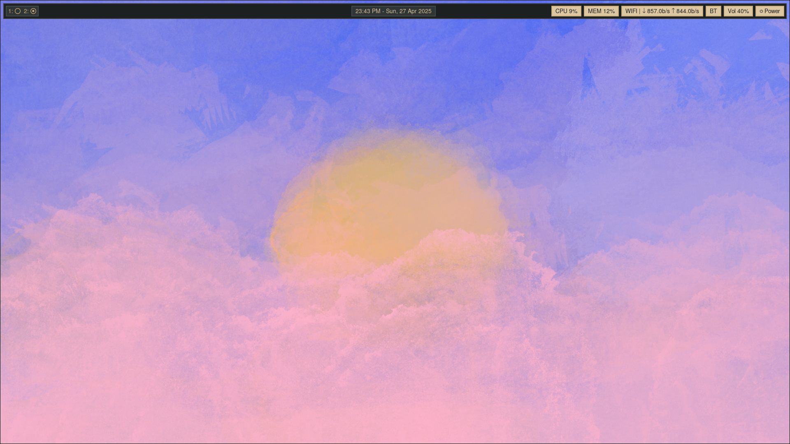
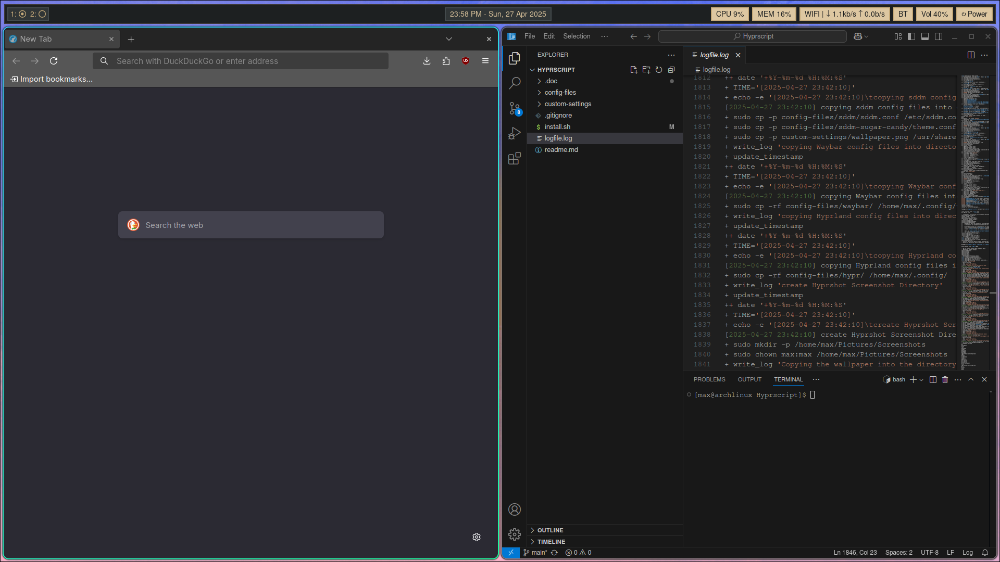

# About this project:

Hyprscript is supposed to be a Hyprland install script. You will be able to install and use Hyprscript, after you install Arch Linux on your device via Archinstall for example.
What Hyprscript does, is that it install Packages and Configs and configures them, so you don't have to install and configure your Hyprland on Arch Linux manually. [More Details here.](#what-is-being-installed)

> [!IMPORTANT]
> Like mentioned [here](config-files/waybar/Disclaimer.md), the Waybar config files are based on the config 
> of [MinimalSwayFX](https://github.com/mubin6th/MinimalSwayFX), which I liked and chose to base the Waybar config of Hyprscript on. Please check out MinimalSwayFX, if you like the look of the Waybar.

# How does it Look:

Here are some Preview Pictures to look at:

### Picture of the Desktop



### Picture of the Desktop with some Applications open


The picture was drawn by me, 4Max0, in case you wondered.

# How to install

## Steps:
Install your Arch Linux and git then copy the repository with the following command:

```
git clone https://github.com/4Max0/Hyprscript.git
```

After that move into the directory you cloned of of git:

```
cd Hyprscript
```

Then run the install script:
```
bash install.sh
```

If you're German like me, you can use the '-de' flag to set the Keyboard Layout to 'de':

```
bash install.sh -de
```

If everything worked out don't forget to remove the cloned repository:
```
cd ..
rm -rf Hyprscript
```

## What to do if an error occurs:
The installation script generates a log file called 'logfile.log' in the Hyprscript directory. If you encounter an error, try to open in and look around for errors. Example using everyone favorite editor vim:

```
vim logfile.log
```

# What is being installed:

If you are rightfully paranoid, with what this Project does to your PC, you might want to check the [config files](config-files/) and the [custom settings](custom-settings/) directories.

In the config files directory you wild find a bunch of, guess what, config files. With also a directory called [packages](config-files/packages/), where you can look at all the necessary Pacman and yay packages that are being installed (yes HTop and Fastfetch are necessary if you use Linux).

In similar fashion you will find in the custom-settings directory in two files called [custom_packages.conf](custom-settings/custom_packages.conf) and [yay_custom_packages.conf](custom-settings/yay_custom_packages.conf). In those files you can add or remove packages, if you want before running the script.

# Keyboard Config:

The Key Binds are mostly the standard Key Binds, with the 'Super' (Windows Key) being the "mainMod" Bind. Here are some important Binds:

| Keybind                   | Action                                |
|---------------------------|---------------------------------------|
| mainMod + Q               | Opens Kitty                           |
| mainMod + C               | Kill Window                           |
| mainMod + M               | Exits Hyprland                        |
| mainMod + E               | Dolphin                               |
| mainMod + V               | Floating Mode                         |
| mainMod + R               | Open Rofi                             |
| mainMod + Number          | Change Workspace                      |
| mainMod + Shift + Number  | move Application to Workspace         |
| mainMod + S               | toggle special Workspace              |
| mainMod + Shift + S       | move Application to special Workspace |
| mainMod + left Click      | move Application                      |
| mainMod + right Click     | resize Application                    |
| mainMod + Shift + L       | Lock screen                           |
| Print                     | Hyprshot regional Screenshot          |
 
